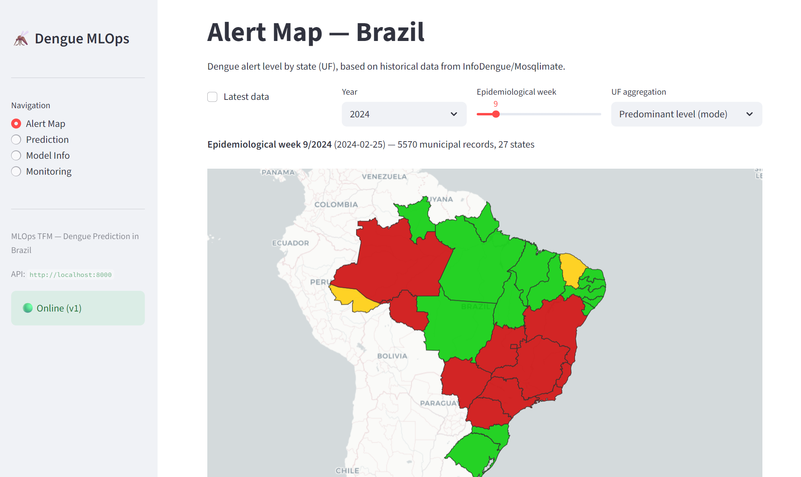
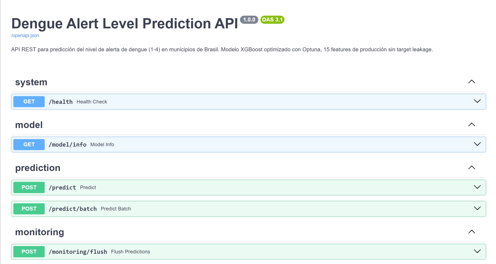
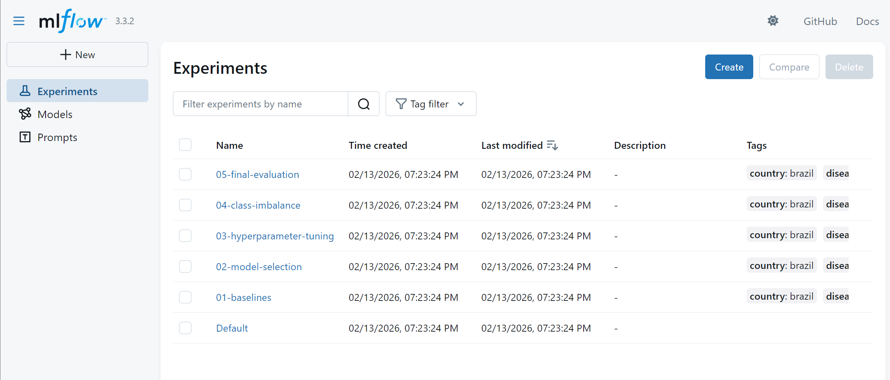
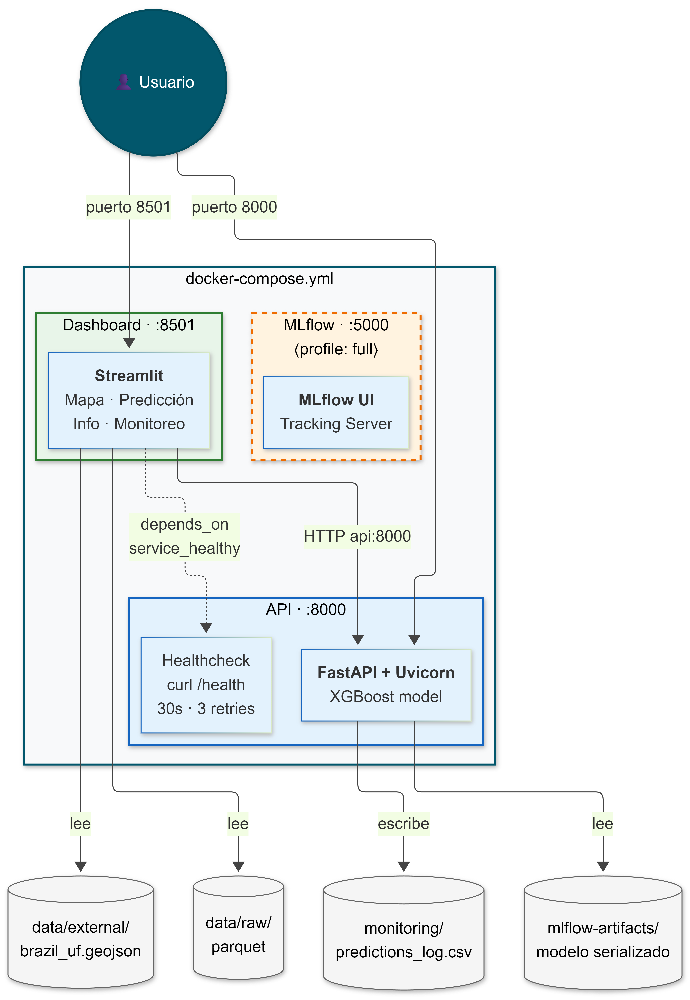
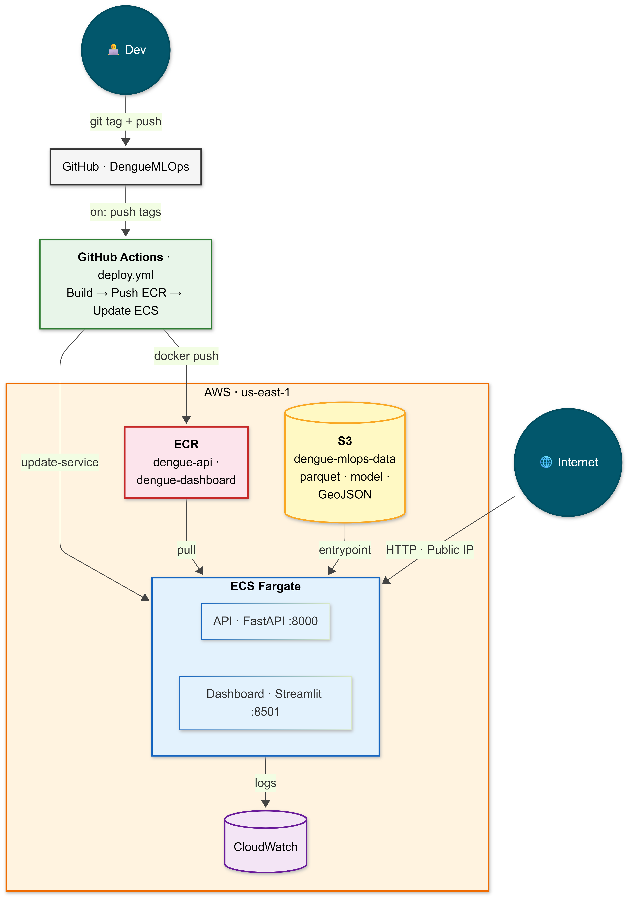

# 🦟 DengueMLOps — Pipeline MLOps Completo para Previsão de Alertas de Dengue

[](https://github.com/jmponcebe/DengueMLOps/actions/workflows/ci.yml)
[](https://www.python.org/downloads/)
[](https://xgboost.readthedocs.io/)
[](https://mlflow.org/)
[](https://fastapi.tiangolo.com/)
[](https://streamlit.io/)
[](https://www.docker.com/)
[](https://aws.amazon.com/)
[](https://www.evidentlyai.com/)
[](LICENSE)

> 🇬🇧 [Read in English](README.md) · 🇪🇸 [Leer en español](README.es.md)

Pipeline de ML de nível produção que prevê **níveis de alerta de dengue** (1-4) em mais de 5.500 municípios brasileiros, utilizando exclusivamente variáveis epidemiológicas sem vazamento de dados. Desenvolvido como demonstração de práticas MLOps modernas: rastreamento de experimentos, servir modelos, conteinerização, CI/CD, implantação na nuvem e monitoramento de data drift.

> **Trabalho de Conclusão de Mestrado** — CIDaeN, Universidad de Castilla-La Mancha (UCLM), Espanha

---

## Destaques

| O quê | Como |
| --- | --- |
| **Dados** | 4,5M registros semanais (2010-2025) da [API Mosqlimate](https://api.mosqlimate.org/) |
| **Features** | 15 variáveis engenheiradas, zero vazamento de dados, lags climáticos baseados em biologia vetorial |
| **Modelo** | XGBoost + pesos balanceados, otimizado com Optuna (40 trials). macro_f1=0,39 no teste 2024 |
| **Rastreamento** | 5 experimentos MLflow, +90 execuções, Model Registry com alias champion |
| **Serviço** | API REST com FastAPI + dashboard Streamlit com mapa coroplético interativo do Brasil |
| **Contêineres** | Setup Docker multi-imagem, orquestração com Compose e health checks |
| **CI/CD** | GitHub Actions — testes/lint no push, deploy para AWS ECR/ECS em tags de versão |
| **Nuvem** | AWS ECS/Fargate + S3 + ECR, Infraestrutura como Código (CloudFormation) |
| **Monitoramento** | Detecção de data drift com Evidently, logging de previsões com auto-flush |
| **Testes** | 88 testes unitários, 97% de cobertura na engenharia de features |

---

## Demo

### Dashboard Streamlit — Mapa de Alertas do Brasil

<p align="center">
  
</p>

### FastAPI — Documentação Swagger Autogenerada

<p align="center">
  
</p>

### MLflow — Rastreamento de Experimentos

<p align="center">
  
</p>

---

## Arquitetura

### Docker Compose

<p align="center">
  
</p>

### Implantação na AWS (ECS/Fargate)

<p align="center">
  
</p>

---

## Início Rápido

### Pré-requisitos

- Python 3.11+
- Docker e Docker Compose (para implantação conteinerizada)

### Instalação

```bash
git clone https://github.com/jmponcebe/DengueMLOps.git
cd DengueMLOps
python -m venv .venv
source .venv/bin/activate  # Windows: .venv\Scripts\activate
pip install -r requirements.txt
```

### Baixar Dados e Modelo

```bash
python scripts/setup_data.py          # Baixa modelo champion + GeoJSON
python scripts/setup_data.py --all    # Também baixa dados históricos (precisa de API key)
```

O script de setup baixa:
- **Modelo champion** do [GitHub Releases](https://github.com/jmponcebe/DengueMLOps/releases) (~6 MB)
- **GeoJSON do Brasil** da API do IBGE para o mapa do dashboard
- **Dados históricos** da [API do Mosqlimate](https://api.mosqlimate.org/) (opcional, ~1.5 GB, requer API key gratuita)

### Executar com Docker (recomendado)

```bash
docker compose up --build
# API:       http://localhost:8000
# Dashboard: http://localhost:8501
# Swagger:   http://localhost:8000/docs
```

### Executar localmente

```bash
# Terminal 1: API
uvicorn app.api:app --host 0.0.0.0 --port 8000

# Terminal 2: Dashboard
streamlit run app/streamlit_app.py
```

### Executar testes

```bash
pytest tests/ -v --cov=src
```

---

## Estrutura do Projeto

```text
├── app/                     # Implantação
│   ├── api.py               # API REST FastAPI (5 endpoints)
│   ├── schemas.py           # Modelos Pydantic para validação
│   └── streamlit_app.py     # Dashboard interativo (4 páginas)
├── src/                     # Código de produção
│   ├── data/                # Ingestão (cliente API + carregador Parquet)
│   ├── features/            # DengueFeatureEngineer (15 features, anti-vazamento)
│   ├── models/              # Treinamento, avaliação, integração MLflow
│   └── monitoring/          # Detecção de drift com Evidently
├── notebooks/               # Exploração e experimentação
│   ├── 01-exploratory-data-analysis.ipynb
│   ├── 02-feature-engineering.ipynb
│   └── 03-modeling.ipynb
├── configs/                 # Configuração MLflow e projeto
├── tests/                   # 88 testes unitários
├── scripts/                 # Scripts de implantação AWS e entrypoints
├── aws/                     # Template CloudFormation (IaC)
├── .github/workflows/       # Pipelines CI/CD
├── Dockerfile.api           # Contêiner API
├── Dockerfile.dashboard     # Contêiner Dashboard
└── docker-compose.yml       # Orquestração multi-serviço
```

---

## Práticas MLOps

### Rastreamento de Experimentos (MLflow)

5 experimentos sequenciais, cada um construindo sobre as conclusões do anterior:

| # | Experimento | Runs | Descoberta Chave |
| --- | --- | --- | --- |
| 01 | baselines | 4 | Piso: macro_f1=0,23 (dummy) |
| 02 | model-selection | 5 | A escolha do algoritmo quase não importa com dados desbalanceados |
| 03 | hyperparameter-tuning | 2+80 | Optuna + runs aninhados, melhoria mínima |
| 04 | class-imbalance | 2 | **Pesos balanceados: +38% macro_f1** (a descoberta) |
| 05 | final-evaluation | 3 | Campeão em dados de teste 2024 não vistos |

Conclusão chave: **o tratamento do desbalanceamento de classes** (pesos balanceados por frequência inversa) tem muito mais impacto do que a seleção de algoritmo ou o tuning de hiperparâmetros quando lidando com razões de classe de 460:1.

### Engenharia de Features (Zero Vazamento)

O maior desafio: datasets de dengue contêm variáveis epidemiológicas (casos, Rt, incidência) que são **derivadas do alvo**. Usá-las produz métricas artificialmente infladas.

Nossas 15 features de produção usam **apenas** informação temporal, climática (com lag biológico) e geográfica:

- Variáveis climáticas com lag de 4-8 semanas (coincidindo com o ciclo vetorial: ovo → adulto → picada → diagnóstico)
- `shift(1)` antes de `rolling()` para evitar vazamento da observação atual
- Codificação regional por conhecimento de domínio (5 macrorregiões brasileiras), não target encoding

### Servir Modelos

- API REST **FastAPI** com validação Pydantic e documentação OpenAPI autogenerada
- **Carregamento resiliente**: MLflow Registry → fallback para artefato local
- Dashboard **Streamlit** com mapa coroplético do Brasil (Plotly + GeoJSON do IBGE)

### Pipeline CI/CD

```text
Push para main → CI (teste → lint → docker build + smoke test)
Git tag v* → CD (build imagens → push para ECR → atualizar serviços ECS)
```

### Monitoramento

- Detecção batch de drift com Evidently (teste KS para numéricas, chi² para categóricas)
- Logging de previsões com buffer auto-flush (100 previsões → CSV)
- Relatórios de drift interativos acessíveis pelo dashboard Streamlit

### Implantação na Nuvem (AWS)

- **Infraestrutura como Código**: Template CloudFormation para S3 + ECR + ECS/Fargate
- **Duas opções de implantação**: EC2 (simples/econômico) e ECS/Fargate (escalável/gerenciado)
- **Separação de dados**: As imagens não contêm dados — contêineres baixam do S3 na inicialização
- **Setup automatizado**: Script de 4 fases (stack → upload S3 → push ECR → serviços ECS)

---

## Decisões Técnicas Chave

| Decisão | Justificativa |
| --- | --- |
| Imagens separadas para API e Dashboard | Escalamento independente (API usa CPU, Dashboard usa I/O) |
| Lags climáticos de 4-8 semanas | Coincide com o ciclo biológico do vetor (ovo → adulto → transmissão → diagnóstico) |
| `pop_log` como feature principal | A dengue é fundamentalmente urbana; a população captura densidade e habitats vetoriais |
| Pesos balanceados | Com 93,1% de classe 1, modelos sem pesos ignoram os alertas minoritários |
| Split temporal treino/val/teste | Respeita a ordem temporal; 2024 como teste (ano recorde de dengue no Brasil) |
| Alias champion no MLflow | A API carrega o modelo por alias, desacoplado de IDs de execução específicos |

---

## Stack Tecnológico

| Categoria | Tecnologias |
| --- | --- |
| **Core** | Python 3.13, Pandas, NumPy, Scikit-learn |
| **ML** | XGBoost, Optuna, SHAP |
| **MLOps** | MLflow (tracking + registry + evaluate), Evidently |
| **App** | FastAPI, Streamlit, Pydantic, Plotly |
| **Testes** | Pytest (88 testes, 97% cobertura em features) |
| **Infra** | Docker, Docker Compose, GitHub Actions |
| **Nuvem** | AWS S3, ECR, ECS/Fargate, CloudFormation |

---

## Dados

| Aspecto | Detalhe |
| --- | --- |
| **Fonte** | [API Mosqlimate](https://api.mosqlimate.org/) — dados epidemiológicos + climáticos |
| **Volume** | 4,5M registros semanais, +5.500 municípios |
| **Período** | 2010-2025 |
| **Alvo** | Nível de alerta 1-4 (93,1% nível 1 — desbalanceamento extremo) |
| **Treino** | 2010-2021 (3,48M registros) |
| **Validação** | 2022-2023 (584K registros) |
| **Teste** | 2024 (290K registros) — ano recorde de dengue no Brasil |

---

## Endpoints da API

| Método | Endpoint | Descrição |
| --- | --- | --- |
| `GET` | `/health` | Health check para Docker/balanceadores de carga |
| `GET` | `/model/info` | Metadados do modelo carregado |
| `POST` | `/predict` | Previsão individual (15 features → nível de alerta + probabilidades) |
| `POST` | `/predict/batch` | Previsão em lote |
| `POST` | `/monitoring/flush` | Forçar flush do buffer de previsões para CSV |

---

## Roteiro

- [ ] **Integração DVC** — Versionar dados e artefatos de modelo com [DVC](https://dvc.org/) para reprodutibilidade completa (`dvc pull` para obter tudo)
- [ ] **Retreinamento automático** — Pipeline periódico acionado por detecção de drift
- [ ] **Monitoramento avançado** — Monitoramento do desempenho do modelo com loop de feedback
- [ ] **Multi-model serving** — Testes A/B entre versões de modelo via API
- [ ] **Feature store** — Computação e serviço centralizado de features

---

## Licença

Este projeto está licenciado sob a [Licença MIT](LICENSE).

Desenvolvido como Trabalho de Conclusão de Mestrado no [CIDaeN](https://cidaen.uclm.es/), Universidad de Castilla-La Mancha (UCLM), Espanha.

---

*Desenvolvido por [Jose María Ponce Bernabé](https://github.com/jmponcebe) — 2025*
